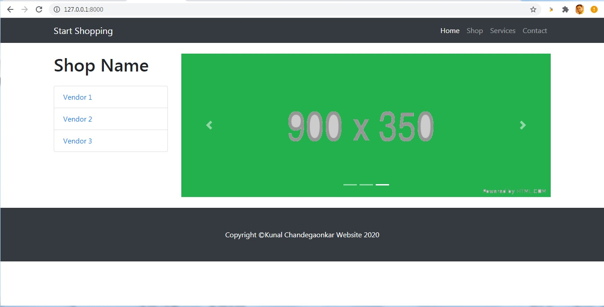
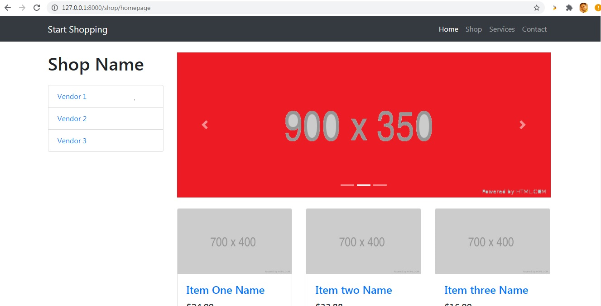

# shopping
PHP Symfony shopping cart 

## Requirements

- composer
- php >= 7.3
- mysql >= 5.0.2

## Installation
### Webserver

- run `git clone https://github.com/kvc2983/shopping.git` command to clone repository on local folder
- Inside the symfony directory run Following command
- run `composer install` command
- add database on your mysql server Ex. I named it as shopping_cart
- copy `.env` file to `.env.local` and type your local environment variables, eg. mysql connection
- run `php bin/console doctrine:migrations:migrate` to add database tables

- You can access through  http://127.0.0.1:8000/

### Database sql to insert dummy records:
- Insert records in product table:
INSERT INTO `product` (`id`, `name`, `decription`, `price`, `quantity`, `img`, `date_added`) VALUES
(7, 'Item One Name', 'Lorem ipsum dolor sit amet, consectetur adipisicing elit. Amet numquam aspernatur!', '24.99', 5, 'http://placehold.it/700x400', '2020-09-30 22:09:17'),
(8, 'Item two Name', 'Lorem ipsum dolor sit amet, consectetur adipisicing elit. Amet numquam aspernatur! Lorem ipsum dolor sit amet.', '33.88', 7, 'http://placehold.it/700x400', '2020-09-30 22:09:17'),
(11, 'Item three Name', 'Lorem ipsum dolor sit amet, consectetur adipisicing elit. Amet numquam aspernatur! Lorem ipsum dolor sit amet.', '16.99', 7, 'http://placehold.it/700x400', '2020-09-30 22:09:17'),
(12, 'Item four Name', 'Lorem ipsum dolor sit amet, consectetur adipisicing elit. Amet numquam aspernatur! Lorem ipsum dolor sit amet.', '49.00', 7, 'http://placehold.it/700x400', '2020-09-30 22:09:17'),
(13, 'Item Five Name', 'Lorem ipsum dolor sit amet, consectetur adipisicing elit. Amet numquam aspernatur! Lorem ipsum dolor sit amet.', '12.00', 7, 'http://placehold.it/700x400', '2020-09-30 22:09:17'),
(14, 'Item six Name', 'Lorem ipsum dolor sit amet, consectetur adipisicing elit. Amet numquam aspernatur! Lorem ipsum dolor sit amet.', '66.45', 7, 'http://placehold.it/700x400', '2020-09-30 22:09:17');

Home Page Screen:

Shop page Screen:

MySQL databse Dump:
- Please find file at Databse_dump/shopping_cart